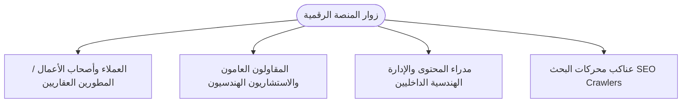

# وثيقة متطلبات المنتج (PRD) — منصة E-MEP الهندسية
## Product Requirement Document (PRD) - E-MEP Corporate & Engineering Platform

---

### معلومات الوثيقة (Document Metadata)
| البند | التفاصيل |
| :--- | :--- |
| **اسم المشروع** | منصة شركة E-MEP للمقاولات والأعمال الكهروميكانيكية |
| **إصدار الوثيقة** | v2.0 (Production-Ready) |
| **حالة المشروع** | قيد التشغيل والإنتاج (Live Production) |
| **المالك / المطور** | فريق التطوير الهندسي والتقني لشركة E-MEP |
| **تاريخ التحديث** | أغسطس 2026 |
| **التقنيات الأساسية** | Next.js 16, React 19, TypeScript, Tailwind CSS v4, Supabase (PostgreSQL), OGL WebGL |

---

## 1. نظرة عامة على المنتج (Product Overview)

### 1.1 نبذة عن الشركة (Company Background)
تأسست شركة **E-MEP** في عام **2019** في جمهورية مصر العربية (المقر الرئيسي: التجمع الخامس، القاهرة الجديدة)، وهي شركة رائدة في مجال مقاولات واستشارات الهندسة الكهروميكانيكية (MEP). ترتكز قيم الشركة على: **النزاهة، الصدق، الأصالة، والإخلاص**.

### 1.2 الرؤية والرسالة (Vision & Mission)
* **الرؤية (Vision):** أن تكون الشركة المقاول الكهروميكانيكي الأكثر تنافسية وموثوقية في منطقة الشرق الأوسط، بتقديم حلول هندسية ذكية تضع العميل أولاً وتعتمد أحدث التطورات التكنولوجية.
* **الرسالة (Mission):** تقديم قيمة هندسية مضافة وفائقة الدقة عبر تنفيذ مشاريع التكييف، الكهرباء، السباكة، مكافحة الحريق، ونمذجة معلومات البناء (BIM) وفق أعلى المعايير القياسية العالمية.

### 1.3 الهدف من المنصة الرقمية (Product Purpose)
توفير منصة ويب مؤسسية متطورة وفائقة السرعة ثنائية اللغة (عربي / إنجليزي) تخدم الأهداف التالية:
1. استعراض الهوية المؤسسية وسابقة الأعمال الضخمة (Portfolio) لقطاعات التجزئة، المطاعم، وصالات العرض الكبرى.
2. استقطاب طلبات عروض الأسعار والاستشارات الهندسية (Lead Generation) عبر قنوات مؤتمتة (Email / WhatsApp Direct).
3. إبراز القدرات التقنية للشركة في نمذجة الـ **BIM 3D** وحل التعارضات المكانية (Clash Detection).
4. تعزيز تصدر محركات البحث (SEO) من خلال مدونة هندسية متخصصة ومقالات دورية.
5. توفير لوحة تحكم إدارة محتوى (Admin Dashboard) متقدمة لإدارة المشروعات والمقالات وتخزين الوسائط مع ضغط الصور التلقائي.

---

## 2. الجمهور المستهدف والشخصيات (Target Audience & User Personas)



### 2.1 شرائح المستخدمين (User Segments)
1. **أصحاب الأعمال وسلاسل العلامات التجارية (Commercial & Retail Clients):**
   * *الهدف:* الاطلاع على سابقة الأعمال في قطاعهم (Retail, Dining, Showrooms) وطلب تنفيذ كهروميكانيكي فوري.
2. **المكاتب الاستشارية والمقاولون العامون (Consultants & General Contractors):**
   * *الهدف:* تقييم القدرات الهندسية (BIM 3D, Shop Drawings, حسابات الهيدروليك والأحمال الحرارية).
3. **فريق إدارة E-MEP (Admin & Content Managers):**
   * *الهدف:* إضافة وتعديل المشروعات المنجزة، كتابة مقالات المدونة، وإدارة صور المشاريع.

---

## 3. المعمارية الفنية وحزمة التقنيات (Technical Stack & Architecture)

```mermaid
flowchart TB
    subgraph Frontend [واجهة المستخدم - Next.js 16 + React 19]
        UI[الموقع ثنائي اللغة AR / EN]
        Hero[OGL WebGL 3D Interactive Canvas]
        AdminUI[لوحة التحكم التفاعلية /admin]
        BlogUI[المدونة ومحرك المقالات /blog]
    end

    subgraph Backend [Next.js App Router API Routes]
        ContactAPI[/api/contact - Spam Shield + SMTP]
        ProjectsAPI[/api/projects - CRUD]
        ArticlesAPI[/api/articles - CRUD]
        UploadAPI[/api/upload - Supabase Storage]
        AdminAuth[/api/admin/verify - PIN/Cookie Auth]
    end

    subgraph DatabaseStorage [قاعدة البيانات والتخزين السحابي]
        SupaDB[(Supabase PostgreSQL)]
        SupaBucket[(Supabase Storage: projects bucket)]
        JSONFallback[(Local JSON Fallback: projects.json / articles.json)]
    end

    UI --> ContactAPI
    AdminUI --> ProjectsAPI & ArticlesAPI & UploadAPI & AdminAuth
    ProjectsAPI & ArticlesAPI --> SupaDB
    ProjectsAPI & ArticlesAPI -.->|Fallback on failure| JSONFallback
    UploadAPI --> SupaBucket
```

| الطبقة (Layer) | التقنية (Technology) | الدور والأهمية |
| :--- | :--- | :--- |
| **إطار العمل (Framework)** | **Next.js 16 (App Router)** | يدعم SSR و ISR و Static Generation لتوليد الصفحات بأقصى سرعة وأفضل SEO. |
| **مكتبة الواجهة (UI Library)** | **React 19 & TypeScript** | بناء واجهات تفاعلية آمنة برمجياً مع إدارة حالة فائقة الأداء. |
| **التنسيق والتصميم (Styling)** | **Tailwind CSS v4 + Radix UI + CSS Modern Variables** | تصميم فاخر، متوافق كلياً مع الشاشات، ويدعم الاتجاهين LTR / RTL. |
| **المؤثرات البصرية (Visuals/3D)** | **OGL WebGL Library** | لوحة تفاعلية ثلاثية الأبعاد (Interactive Hero Canvas) تتجاوب مع حركة الماوس. |
| **قاعدة البيانات (Database)** | **Supabase PostgreSQL** | تخزين المشروعات والمقالات وتأمينها عبر سياسات Row Level Security (RLS). |
| **التخزين السحابي (Object Storage)** | **Supabase Storage (projects bucket)** | رفع وحفظ صور المشروعات والمدونة وتوزيعها عبر شبكة CDN فائقة السرعة. |
| **إرسال البريد (Mailing Engine)** | **Nodemailer** | إرسال استفسارات العملاء بصيغة HTML منسقة عبر خوادم SMTP المؤمنة. |
| **محرك الأمان والسبام** | **Math Captcha + Honeypot Detection** | صد الهجمات وروبوتات الرسائل العشوائية بنسبة 100%. |

---

## 4. المتطلبات الوظيفية الشاملة (Functional Requirements)

### 4.1 المحرك ثنائي اللغة (Bilingual Engine & RTL/LTR Support)
* **المتطلب:** دعم كامل وفوري للغتين (العربية والإنجليزية) بتبديل حي دون إعادة تحميل الصفحة (`LanguageContext`).
* **السلوك:**
  * عند اختيار العربية: اتجاه المستند `dir="rtl"` وتطبيق الخطوط والترجمات العربية.
  * عند اختيار الإنجليزية: اتجاه المستند `dir="ltr"` والترجمات الإنجليزية.
  * حفظ تفضيل اللغة محلياً في المتصفح لاسترجاعه عند العودة.

### 4.2 قسم البطل التفاعلي (Interactive 3D Hero Section)
* **المتطلب:** واجهة بصرية ملهمة ومبتكرة تعكس الطابع الهندسي الرقمي لشركة E-MEP.
* **المكونات:**
  * شبكة جزيئات/خطوط هندسية بتقنية **WebGL (OGL)** تتفاعل مع حركة المؤشر ولمس الشاشة.
  * نصوص متحركة مع زر استدعاء إجراءات مباشر (CTA) يوجه لنظام الاستشارات وحسابات الواتساب.

### 4.3 أقسام الخدمات والخبرات الكهروميكانيكية (MEP Expertise)
* **المجالات المغطاة:**
  1. **التكييف والميكانيكا (HVAC & Mechanical):** شبكات الشيلر Chilled Water، منظومات الـ VRF، مجاري الهواء وحسابات الأحمال.
  2. **الكهرباء والطاقة (Electrical & Power):** الجهد المتوسط والمنخفض، لوحات التوزيع، المولدات، والمحولات.
  3. **السباكة والبنية التحتية (Plumbing & Infrastructure):** شبكات التغذية، الصرف الصحي، محطات الرفع، ومعالجة المياه.
  4. **أنظمة مكافحة الحريق (Firefighting & Life Safety):** الرش الآلي Sprinklers، غازات الإطفاء FM200/Novec، وطلمبات الحريق.
  5. **التيار الخفيف والتحكم (Low Current & Automation):** إنذار الحريق، كاميرات المراقبة، الصوتيات، وشبكات البيانات.
  6. **التصميم الرقمي والـ BIM:** إعداد المخططات التنفيذية Shop Drawings، وRiser Diagrams، وحل التعارضات المكانية.

### 4.4 معرض المشروعات وسابقة الأعمال (Dynamic Projects Portfolio)
* **المتطلب:** عرض تفاعلي لمشاريع الشركة المنجزة مع تصنيفات دقيقة:
  * **الكل (All)**
  * **التجزئة والمحلات التجارية (Retail)**
  * **المطاعم والكافيهات (Dining)**
  * **صالات العرض والمعارض (Showrooms)**
* **الميزات:**
  * تصفية ديناميكية فورية (Instant Filter) دون إعادة تحميل الصفحة.
  * نظام العرض التدريجي (Show More / Show Less) لدعم تجربة تصفح سريعة.
  * نوافذ منبثقة تفصيلية (Modal Viewer) لعرض صور وبيانات المشروع باللغتين.
  * مواءمة عرض الصور عبر مكون `SafeImage` مع استخدام بدائل في حال انقطاع رابط الصورة.

### 4.5 محرك المدونة والمقالات الهندسية (SEO Engineering Blog)
* **المتطلب:** نظام نشر هندسي متكامل لرفع ترتيب الموقع في جوجل واستعراض المعرفة الفنية.
* **الميزات:**
  * مسارات ديناميكية للصفحات عبر الرابط الدائم (`/blog/[slug]`).
  * حساب تلقائي لزمن القراءة (Estimated Reading Time).
  * مقالات ذات صلة مقترحة (Related Articles).
  * دعم التحديث التلقائي للصفحات الثابتة (ISR - Incremental Static Regeneration) كل 60 ثانية.

### 4.6 محرك التقاط العملاء والتواصل الفني (Contact & Lead Generation System)
* **المتطلب:** استمارة ذكية ثنائية القناة تتيح للعميل اختيار طريقة التواصل المفضلة:
  1. **الإرسال عبر البريد الإلكتروني الرسمي:**
     * معالجة الطلب في الخادم عبر `/api/contact`.
     * فحص حقل الـ Honeypot المخفي لحظر البوتات.
     * التحقق من حل المسألة الحسابية (Math Captcha).
     * تطهير المدخلات (Sanitization & HTML Escaping) للحماية من ثغرات XSS.
     * إرسال تنبيه منسق لبريد إدارة E-MEP (`Info@emep-egy.com`).
     * إعادة التوجيه لصفحة الشكر وقياس التحويلات (`/thank-you`).
  2. **التواصل المباشر عبر واتساب (WhatsApp Direct):**
     * توجيه الرسالة مجهزة ومعدة مسبقاً لأحد مدراء الهندسة المعتمدين (المهندس أسامة محمد / المهندس علي ربيع).

### 4.7 لوحة تحكم الإدارة الشاملة (Admin Management Dashboard)
* **الرابط:** `/admin`
* **الميزات الأمنية:**
  * نظام مصادقة بالرقم السري (PIN Authentication) وتخزين الـ Token في ملفات تعريف ارتباط مشفرة (HTTP-only Cookies).
* **إدارة المشروعات (Projects CRUD):**
  * إضافة، تعديل، وحذف المشروعات.
  * محرر نصوص ثنائي اللغة (عربي / إنجليزي) للعناوين والوصف والتصنيف.
* **إدارة المدونة (Articles CRUD):**
  * إضافة مقالات جديدة مع Slug فريد.
  * محرر ثري للمحتوى والملخص والمؤلف وزمن القراءة.
* **إدارة الوسائط والصور (Media Management & Compression):**
  * ضغط الصور في المتصفح وتحويلها تلقائياً إلى صيغة **WebP** خفيفة الحجم قبل الرفع.
  * رفع فوري إلى سحابة Supabase Storage في الـ Bucket المسمى `projects`.
* **مزامنة البيانات (Data Synchronization):**
  * إمكانية مزامنة البيانات بين Supabase وقاعدة البيانات الاحتياطية المحلية (JSON Fallback).

---

## 5. نموذج وقاعدة البيانات (Database Schema & Storage)

### 5.1 جدول المشروعات (`public.projects`)
```sql
CREATE TABLE public.projects (
  id BIGINT PRIMARY KEY GENERATED ALWAYS AS IDENTITY,
  image TEXT NOT NULL,
  title_en TEXT NOT NULL,
  title_ar TEXT NOT NULL,
  category TEXT NOT NULL,
  cat_en TEXT NOT NULL,
  cat_ar TEXT NOT NULL,
  desc_en TEXT NOT NULL,
  desc_ar TEXT NOT NULL,
  created_at TIMESTAMPTZ DEFAULT NOW(),
  updated_at TIMESTAMPTZ DEFAULT NOW()
);
```

### 5.2 جدول المقالات (`public.articles`)
```sql
CREATE TABLE public.articles (
  id BIGINT PRIMARY KEY GENERATED ALWAYS AS IDENTITY,
  slug TEXT UNIQUE NOT NULL,
  title_en TEXT NOT NULL,
  title_ar TEXT NOT NULL,
  summary_en TEXT NOT NULL,
  summary_ar TEXT NOT NULL,
  content_en TEXT NOT NULL,
  content_ar TEXT NOT NULL,
  image TEXT NOT NULL,
  author TEXT DEFAULT 'E-MEP Engineering Team',
  read_time_min INT DEFAULT 5,
  created_at TIMESTAMPTZ DEFAULT NOW(),
  updated_at TIMESTAMPTZ DEFAULT NOW()
);
```

### 5.3 حاويات التخزين (Storage Buckets)
* **اسم الـ Bucket:** `projects` (عام / Public Access).
* **الاستخدام:** تخزين صور المشاريع وغلاف المقالات بصيغ WebP محسنة ومضغوطة.

---

## 6. واجهات برمجة التطبيقات (API Endpoints Specification)

| المسار (Endpoint) | الطريقة (Method) | الوصف | معايير الأمان والتحقق |
| :--- | :---: | :--- | :--- |
| `/api/contact` | `POST` | استلام نموذج التواصل وإرسال البريد الإلكتروني | Honeypot Check + Math Captcha + HTML Escaping |
| `/api/projects` | `GET` | جلب قائمة المشاريع كاملة | مفتوح للعامة (Public Read / Caching) |
| `/api/projects` | `POST` | إنشاء مشروع جديد | يتطلب جلسة Admin مفعلة |
| `/api/projects/[id]` | `PUT / DELETE` | تعديل أو حذف مشروع قائم | يتطلب جلسة Admin مفعلة |
| `/api/articles` | `GET` | جلب مقالات المدونة | مفتوح للعامة |
| `/api/articles` | `POST` | إنشاء مقال جديد في المدونة | يتطلب جلسة Admin مفعلة |
| `/api/articles/[id]` | `PUT / DELETE` | تعديل أو حذف مقال | يتطلب جلسة Admin مفعلة |
| `/api/upload` | `POST` | رفع صور المشاريع إلى Supabase Storage | يتطلب جلسة Admin مفعلة وضغط مسبق |
| `/api/admin/login` | `POST` | التحقق من PIN الإدارة وإنشاء جلسة | فحص معدل الطلبات (Rate Limiting) |
| `/api/admin/verify` | `GET` | التحقق من صلاحية جلسة الأدمن الحالية | قراءة الـ Token المشفر من الكوكيز |
| `/api/admin/logout` | `POST` | إنهاء جلسة الأدمن ومسح الكوكيز | تنظيف آمن للكوكيز |

---

## 7. المتطلبات غير الوظيفية (Non-Functional Requirements)

### 7.1 الأداء والسرعة (Performance)
* **Core Web Vitals:** الحصول على تقييم أخضر (Good) في سرعة التحميل الأولى (LCP < 2.5s) واستجابة التفاعل (INP < 200ms) وثبات التنسيق (CLS < 0.1).
* **ضغط الصور:** تقليل حجم الصور المرفوعة بنسبة تصل إلى **75%** عبر تحويلها إلى WebP قبل الإرسال.
* **التخزين المؤقت (Caching):** تفعيل تقنية ISR مع فترة Revalidation تبلغ 60 ثانية لتسريع الاستجابة وتقليل الحمل على قاعدة البيانات.

### 7.2 التوافق وتجربة المستخدم (Responsiveness & UX)
* توافق مثالي 100% مع كافة الشاشات: الهواتف الذكية (iOS / Android)، الأجهزة اللوحية (Tablets)، الشاشات المحمولة، وشاشات سطح المكتب العريضة بدقة 4K.
* تباين لوني مدروس (WCAG 2.1 AA Compliant) لتوفير أقصى درجات الراحة البصرية والقراءة المريحة.
* صفحة مخصصة لإمكانية الوصول (`/accessibility`) وصفحة خطأ 404 تفاعلية (`/not-found`).

### 7.3 الأمان وحماية البيانات (Security & Reliability)
* **تأمين قاعدة البيانات:** سياسات أمان متطورة (Row Level Security - RLS) تمنع الكتابة غير المصرح بها.
* **الحماية من الثغرات:** منع هجمات XSS وCSRF وحقن التعليمات البرمجية وتطهير كافة مدخلات النماذج.
* **نظام الصمود والاحتياط (High Availability & Resilience):** في حال حدوث أي تعطل طارئ أو بطء في الاتصال بقاعدة بيانات Supabase، تقوم المنصة بالتحول التلقائي والشفاف (Automatic Fallback) إلى ملفات البيانات المحلية (`src/data/projects.json` و `src/data/articles.json`) لضمان عدم توقف الموقع نهائياً للزوار.

---

## 8. مؤشرات الأداء الرئيسية ومقاييس النجاح (KPIs & Success Metrics)

1. **معدل التحويل (Lead Conversion Rate):** زيادة عدد طلبات عروض الأسعار الهندسية عبر النموذج والواتساب بنسبة تتجاوز 35%.
2. **الظهور في محركات البحث (SEO Visibility):** تصدر الكلمات المفتاحية الرئيسية (مقاولات كهروميكانيك، أنظمة مكافحة حريق، تكييف مركزي، BIM 3D Egypt).
3. **سرعة التصفح وانخفاض معدل الارتداد (Bounce Rate):** خفض معدل الارتداد إلى أقل من 30% بفضل السرعة الفائقة والتصميم الجذاب ثلاثي الأبعاد.
4. **كفاءة إدارة المحتوى:** تقليل الوقت اللازم لنشر مشروع جديد أو مقال إلى أقل من دقيقتين عبر لوحة التحكم.

---

## 9. خارطة الطريق والتطوير المستقبلي (Future Roadmap)

* [ ] **المرحلة 1 (Phase 1):** تدشين حاسبة تقديرية تفاعلية لتكلفة أعمال الـ MEP (Online MEP Cost Estimator).
* [ ] **المرحلة 2 (Phase 2):** إطلاق بوابة تفاعلية للعملاء (Client Portal) لمتابعة تقارير تقدم المشروعات الحية وجداول الـ BIM.
* [ ] **المرحلة 3 (Phase 3):** دمج الذكاء الاصطناعي للإجابة على الاستفسارات الهندسية الفورية (AI Engineering Assistant).
